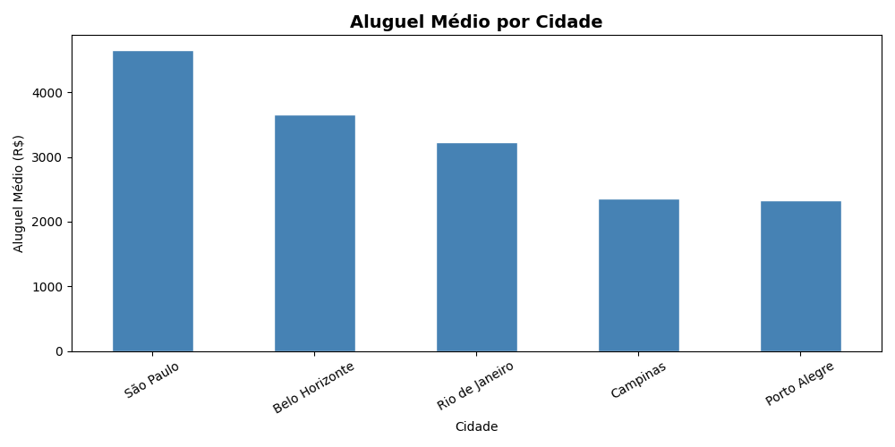
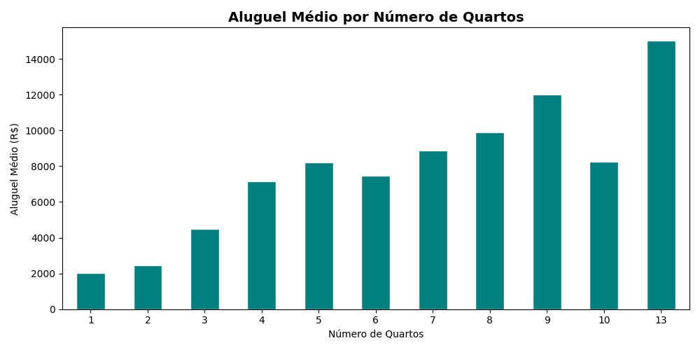
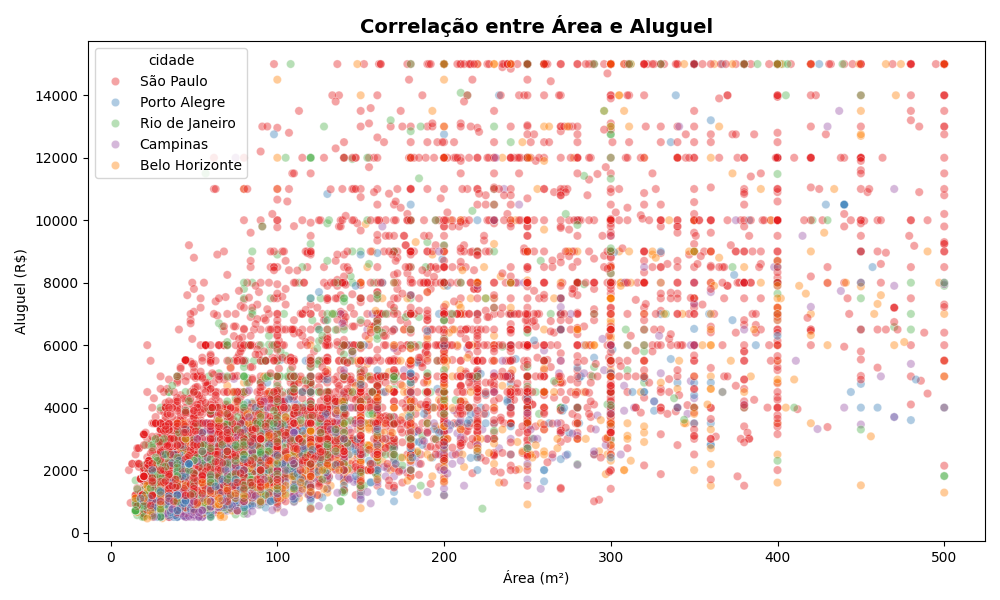
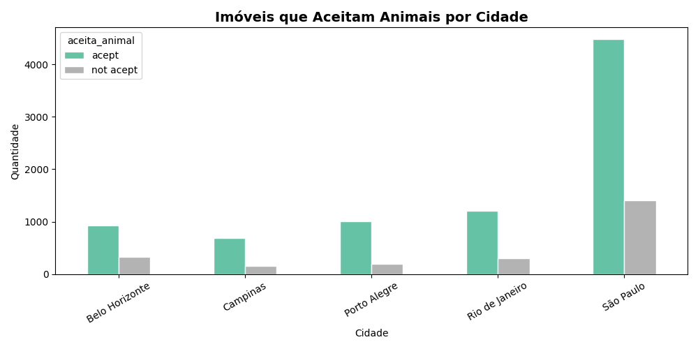

# Analise de Imoveis para Aluguel no Brasil

Analise exploratoria de dados de imoveis para aluguel em 5 cidades brasileiras,
utilizando Python, Pandas, Matplotlib e Seaborn.

## Dataset
- Fonte: [Kaggle - Brazilian Houses to Rent](https://www.kaggle.com/datasets/antonyroy/finaltry)
- 10.692 imoveis em Sao Paulo, Rio de Janeiro, Belo Horizonte, Porto Alegre e Campinas

## Analises Realizadas
- Estatisticas descritivas gerais
- Aluguel medio por cidade
- Aluguel medio por numero de quartos
- Correlacao entre area e aluguel
- Proporção de imoveis que aceitam animais por cidade
- Top 10 imoveis mais caros
- Percentual de imoveis mobiliados por cidade

## Principais Insights
- Sao Paulo tem o maior aluguel medio: R$ 4.652,79
- Porto Alegre tem o menor aluguel medio: R$ 2.337,70
- A mediana (R$ 2.661) e bem menor que a media (R$ 3.896), indicando outliers de imoveis de luxo
- Os 10 imoveis mais caros sao todos em Sao Paulo, com alugueis entre R$ 19.500 e R$ 45.000
- Belo Horizonte e Campinas tem menos de 15% de imoveis mobiliados
- Imoveis com 3 quartos sao os mais comuns no dataset

## Tecnologias
- Python 3.10
- Pandas 2.2.2
- Matplotlib 3.10
- Seaborn 0.13.2

## Como Executar
```bash
pip install pandas matplotlib seaborn
python analise_imoveis.py
```

## Graficos Gerados



